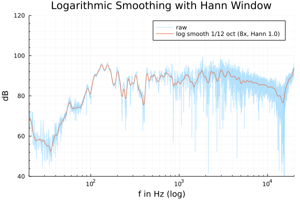

# Logarithmic Smoothing - A Julia Demo

This Julia demo shows how to smooth data on a logarithmic scale. 

View the demo here:
<https://firionus.github.io/logarithmic_smoothing_julia_demo/>



## Quick Summary (TL;DR)

Switch Julia REPL to Pkg mode (hit `]`) and install the packages:
```
add https://github.com/Firionus/NonuniformResampling1D.jl
add https://github.com/Firionus/NonlinearSequences.jl
```
Run:
```julia
using NonuniformResampling1D, NonlinearSequences

x = range(1, 24e3, length=10_000)
y = rand(length(xin))

resolution = 1/12 # octaves
oversampling = 8 # results in `oversampling/resolution` many points per octave

xlog = octspace(20, 20e3, resolution/oversampling)
ylog = nuresample(x, y, xlog, rect_window(.5*oversampling))
```

Smoother results can be achieved with a different window, e.g.
`hann_window(1*oversampling)`.

Other kinds of nonlinear smoothing can be performed by replacing `xlog` with an
appropriately spaced vector. 

## Run the Notebook Yourself

To run the Pluto notebook yourself, clone the repository:

```
git clone https://github.com/Firionus/logarithmic_smoothing_julia_demo.git
```

In Julia, start Pluto with:
```julia
import Pluto; Pluto.run()
```

In Pluto, open the notebook at
`logarithmic_smoothing_julia_demo/logarithmic_smoothing_demo.jl`. 

The code should start running automatically. Cloning the repository is needed
because next to the notebook file, the `Project.toml` needs to be placed. Using
Pluto's integrated package management is not possible with unregistered
packages. 

If you have any problems or feedback, feel free to [open an
issue](https://github.com/Firionus/logarithmic_smoothing_julia_demo/issues/new). 
